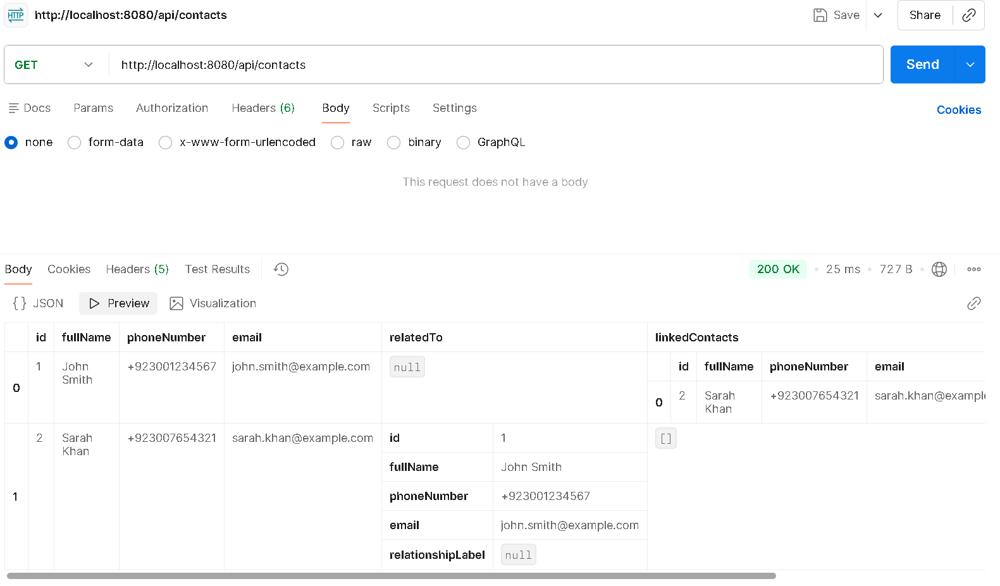
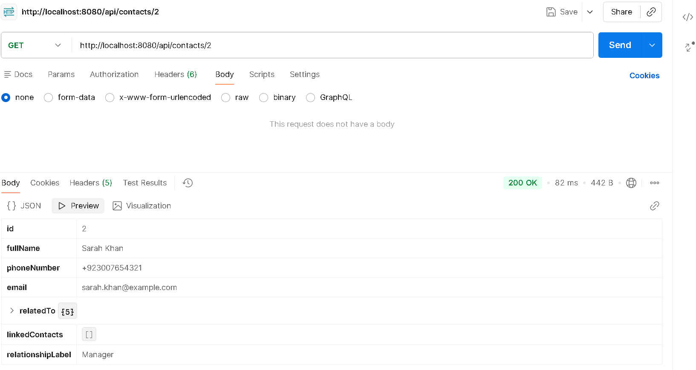
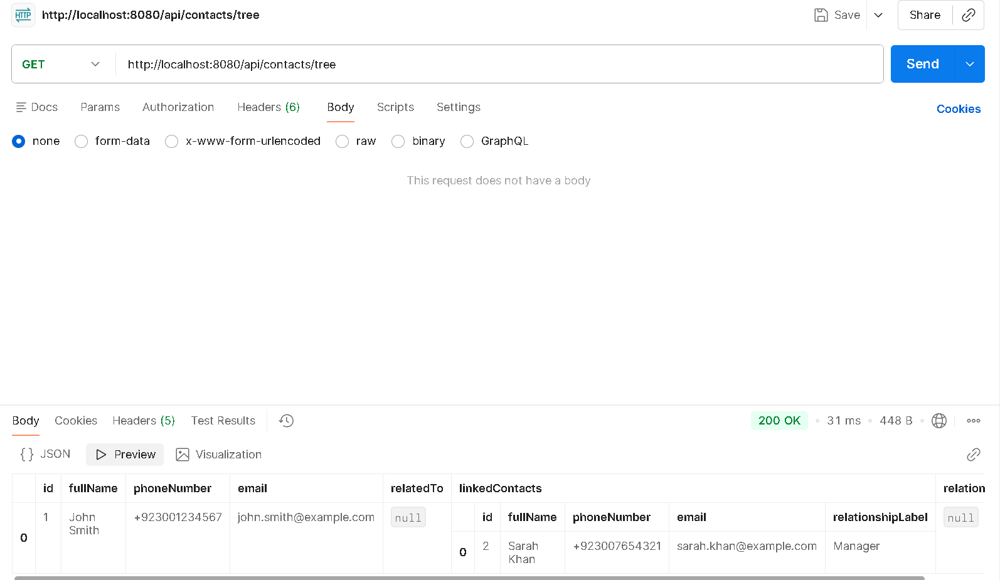
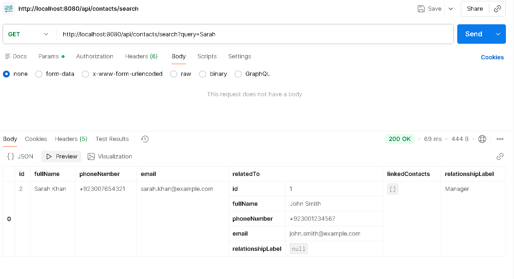

# Contact Management System 

A REST API-based Contact Management System built with Spring Boot and MySQL, featuring full CRUD operations, search, and a bonus contact-linking ("Six Degrees") feature that lets you build a visual relationship tree between contacts.

## Tech Stack
- Java 17
- Spring Boot 3.2.5
- Spring Data JPA
- MySQL 8
- Bean Validation (Jakarta Validation)

## Features
- Full CRUD for contacts (full name, phone number, email)
- Persistent storage via MySQL — data survives restarts
- Search/filter by name, phone, or email (`GET /api/contacts/search?query=...`)
- Input validation on all mandatory fields
- Duplicate-entry handling (rejects duplicate email or phone number with `409 Conflict`)
- **Bonus feature**: link contacts together (e.g. "John is the manager of Sarah") and retrieve the full relationship tree

## Setup Instructions

1. **Create the database** (or let Hibernate auto-create it — already configured):
```sql
   CREATE DATABASE contact_management_db;
```

2. **Update MySQL credentials** in `src/main/resources/application.properties`:
```properties
   spring.datasource.username=root
   spring.datasource.password=your_mysql_password
```

3. **Run the application**:
```bash
   mvn spring-boot:run
```
   The API will start on `http://localhost:8080`.

4. **Test with Postman** using the endpoints below.

## API Endpoints

| Method | Endpoint | Description |
|--------|----------|-------------|
| POST | `/api/contacts` | Create a new contact |
| GET | `/api/contacts` | List all contacts |
| GET | `/api/contacts/{id}` | Get a single contact |
| PUT | `/api/contacts/{id}` | Update a contact |
| DELETE | `/api/contacts/{id}` | Delete a contact |
| GET | `/api/contacts/search?query=faiz` | Search by name, phone, or email |
| POST | `/api/contacts/{id}/link` | Link a contact to another (e.g. manager) |
| DELETE | `/api/contacts/{id}/link` | Remove a contact's link |
| GET | `/api/contacts/tree` | Get the full relationship tree |

## Sample Data (for POST /api/contacts)

```json
{
  "fullName": "John Smith",
  "phoneNumber": "+923001234567",
  "email": "john.smith@example.com"
}
```

```json
{
  "fullName": "Sarah Khan",
  "phoneNumber": "+923007654321",
  "email": "sarah.khan@example.com"
}
```

## Linking Contacts (Relationship Tree Example)

To express "John is the manager of Sarah", link Sarah **to** John:

POST /api/contacts/{sarahId}/link
{
"relatedToId": {johnId},
"relationshipLabel": "Manager"
}


Then fetch the tree:

GET /api/contacts/tree

This returns all root contacts (no manager) with their `linkedContacts` nested underneath — e.g. John will appear with Sarah nested inside as his linked report.

## Sample Run Log

2026-09-21 10:27:32 - Started ContactManagementApplication in 8.317 seconds
2026-09-21 10:29:15 - POST /api/contacts -> 201 Created (John Smith, id: 1)
2026-09-21 10:30:02 - POST /api/contacts -> 201 Created (Sarah Khan, id: 2)
2026-09-21 10:31:18 - POST /api/contacts/2/link -> 200 OK (Sarah linked to John as Manager)
2026-09-21 10:32:40 - GET /api/contacts/tree -> 200 OK (1 root contact returned with nested link)
2026-09-21 10:35:05 - GET /api/contacts/2 -> 200 OK (single contact fetched with populated relatedTo)
2026-09-21 10:37:22 - GET /api/contacts/search?query=Sarah -> 200 OK (1 match found)


## Screenshots

### All Contacts


### Contact with Linked Relationship


### Relationship Tree


### Search Feature


## Author
Muhammad Faiz Alam , Software Development Track
